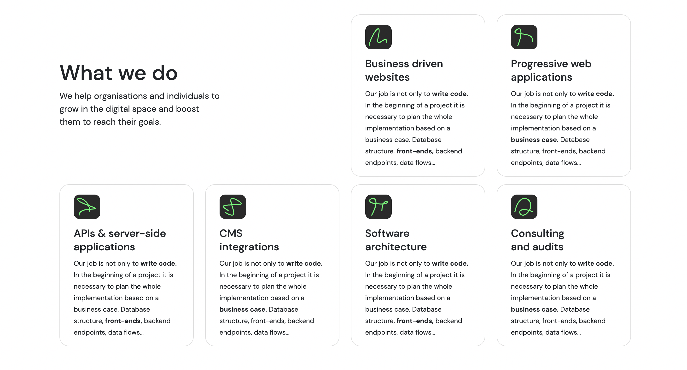
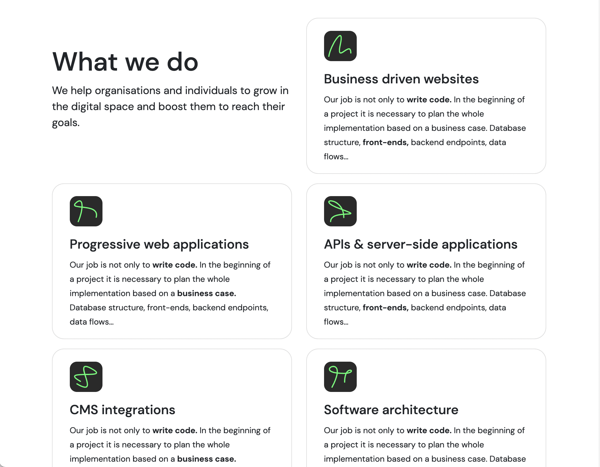
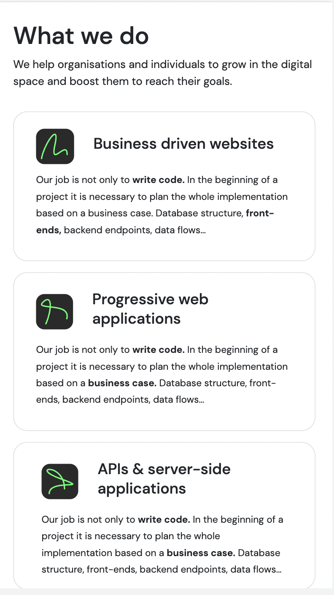

# Project:- Webtoad

> This project consists of building an HTML document that matches the appearance of a part of Webtoad website

## Desktop views

## Tablet views

## Mobile views

Use of Grid and Flex in Designing. Media Query, Positioning and floating of elements to make this site Responsive.

## Built With

- HTML and CSS,
- Grid and Flex,
- Figma
- Media Query
- BootStrap
- Linter

## Live Demo

[Live Demo Link]()

## Authors

👤 **Hemant soni**

- Github: [@hemant-soni-vst-au4](https://github.com/hemant-soni-vst-au4)
- Twitter: [@Hemants63203059](https://twitter.com/Hemants63203059)
- Linkedin: [linkedin](https://www.linkedin.com/in/hemant-soni-97427b193/)

## 🤝 Contributing

Contributions, issues and feature requests are welcome!

Feel free to check the [issues page](https://github.com/hemant-soni-vst-au4/webtoad/issues).

## Show your support

Give a ⭐️ if you like this project!

## Acknowledgments

- Hat tip to anyone whose code was used
- Inspiration
- etc

## 📝 License

This project is [WebToad](https://webtoad.dev/) licensed.